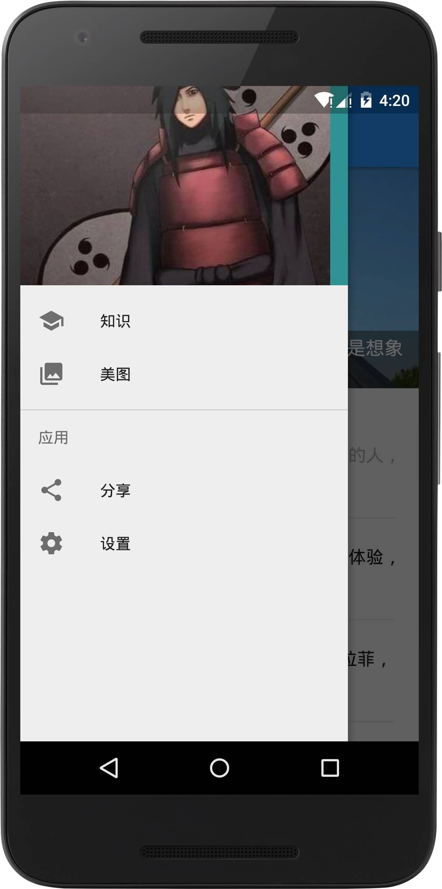

[Check out English version](README_en.md)
--

介绍
===
Knowledge（趣知）是我的MD风格和MVP框架的练习项目。你可以方便地阅读知乎日报和煎蛋网的新鲜事，后续还会增加浏览妹子图的功能，嘿嘿嘿~
截图
---

可以学到的知识：
===
- Android Design库的使用
- 自定义你的基类Activity
- 应用MVP模式到项目中
- 使用Webview时避免内存泄露
- OKhttp封装框架的用法
- 用Gson解析网络数据
- 用Glide加载图片
- 使用Realm缓存数据
- 加特效的启动页的写法
- 设置页的写法
- 添加Activity的转换特效（对，duang的那种）

使用到的库
===

    dependencies {
        debugCompile 'com.squareup.leakcanary:leakcanary-android:1.3.1' //检测内存泄露
        compile 'com.android.support:design:23.1.1'//design控件库
        compile 'com.bigkoo:convenientbanner:2.0.5'//一个图片轮播控件
        compile 'com.android.support:cardview-v7:23.1.1'
        compile 'com.github.bumptech.glide:glide:3.6.0'//图片加载库
        compile 'com.jakewharton:butterknife:7.0.1'//帮你省去findview
        compile 'com.google.code.gson:gson:2.5'
        compile 'com.zhy:okhttputils:2.2.0'//okhttp封装
        compile 'com.android.support:recyclerview-v7:23.1.1'
        compile 'io.realm:realm-android:0.87.4'//快速、简洁的跨平台数据库
        compile 'com.github.orhanobut:logger:1.12'//漂亮的log工具
    }
